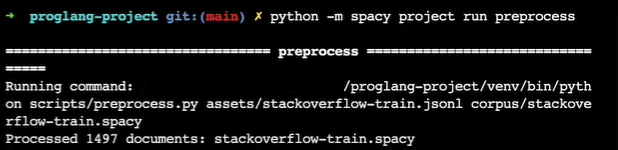
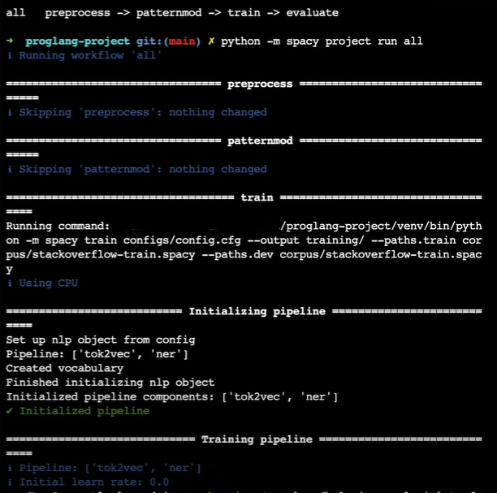
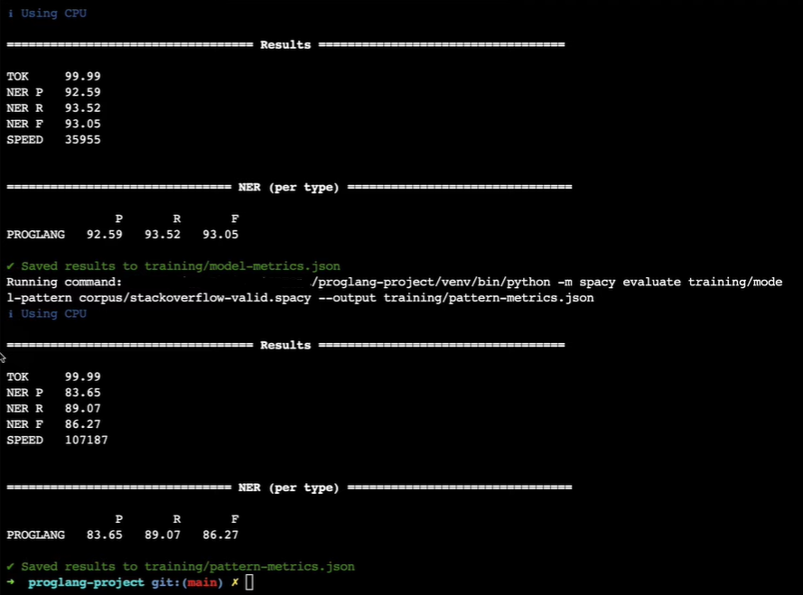
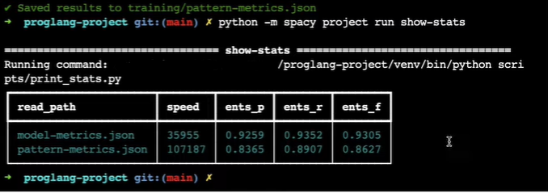

# 🪐 langWhich: NER for Programming Languages

This project seeks to detect programming languages using datasets from Stack Overflow and Reddit.

## 📋 Abstract

The goal of the project is to make a model that could be used generally but it will specifically be used as a Named Entity Recognition exercise on Stack Overflow/Reddit with verticals for Sentiment Analysis. It is an attempt to investigate how the different communities think about different programming languages.

Typically, two models are evaluated using this project; a pattern matching model and a spaCy NER model to pursue a comparison between rule-based Statistics and Machine Learning approaches for NLP.

To export and run this workflow on your local machine, use the [`spacy project run package`](https://spacy.io/api/cli#package) command.

<!-- SPACY PROJECT: AUTO-GENERATED DOCS START (do not remove) -->

## 🗂 project.yml

The [`project.yml`](project.yml) defines the data assets required by the
project, as well as the available commands and workflows. 

### ⏯ Commands

The following commands are defined by the project. They
can be executed using [`spacy project run [name]`](https://spacy.io/api/cli#project-run).
Commands are only re-run if their inputs have changed.

| Command | Description |
| --- | --- |
| `preprocess` | Convert the data to spaCy's binary format |
| `patternmod` | Generate a named entity recognition model based on rules. |
| `train` | Train a named entity recognition model |
| `evaluate` | Evaluate the model and export metrics |
| `package` | Package the trained model so it can be installed |
| `show-stats` | Show the statistics that compares both models. |

### ⏭ Workflows

The following workflows are defined by the project. They
can be executed using [`spacy project run [name]`](https://spacy.io/api/cli#project-run)
and will run the specified commands in order. Commands are only re-run if their
inputs have changed.

| Workflow | Steps |
| --- | --- |
| `all` | `preprocess` &rarr; `patternmod` &rarr; `train` &rarr; `evaluate` |

## 🗂 Assets

The following assets are defined by the project. They can
be fetched by running [`spacy project assets`](https://spacy.io/api/cli#project-assets)
in the project directory.

| File | Source | Description |
| --- | --- | --- |
| [`assets/stackoverflow-train.jsonl`](assets/stackoverflow-train.jsonl) | Local | JSONL-formatted training data |
| [`assets/stackoverflow-valid.jsonl`](assets/stackoverflow-valid.jsonl) | Local | JSONL-formatted validation data |

## 🗂 Config Files

The following configuration files are defined by the project. 
| File | Source | Description |
| --- | --- | --- |
| [`configs/config.cfg`](configs/config.cfg) | Local | CFG-formatted for base config |
| [`configs/proglang_patterns.jsonl`](configs/proglang_patterns.jsonl) | Local | JSONL-formatted rule patterns |

## 🗂 Scripts

The following Python scripts are defined by the project.

| File | Source | Description |
| --- | --- | --- |
| [`scripts/preprocess.py`](scripts/preprocess.py) | Local | Pre-Processing Script |
| [`scripts/save_pattern_model.py`](scripts/save_pattern_model.py) | Local | Pattern NER Script |
| [`scripts/print_stats.py`](scripts/print_stats.py) | Local | Results Comparison Script |

## 📋 Command Line Interface

The commands and workflows can be used with the CLI as follows:

Initialize: `project run` 

Command Execution: `project preprocess`

Workflow Execution: `project all`

Metrics: `project show-stats`

## 📋 References

[`spaCy and spaCy Projects: Documentation`](https://spacy.io/usage/projects)

[`Explosion Templates: GitHub Repository`](https://github.com/explosion/projects)

[`Vincent Warmerdam: GitHub`](https://github.com/koaning)

<!-- SPACY PROJECT: AUTO-GENERATED DOCS END (do not remove) -->

 Some of this documentation has been auto-generated using the [`spacy project document`](https://spacy.io/api/cli#project-document) command!